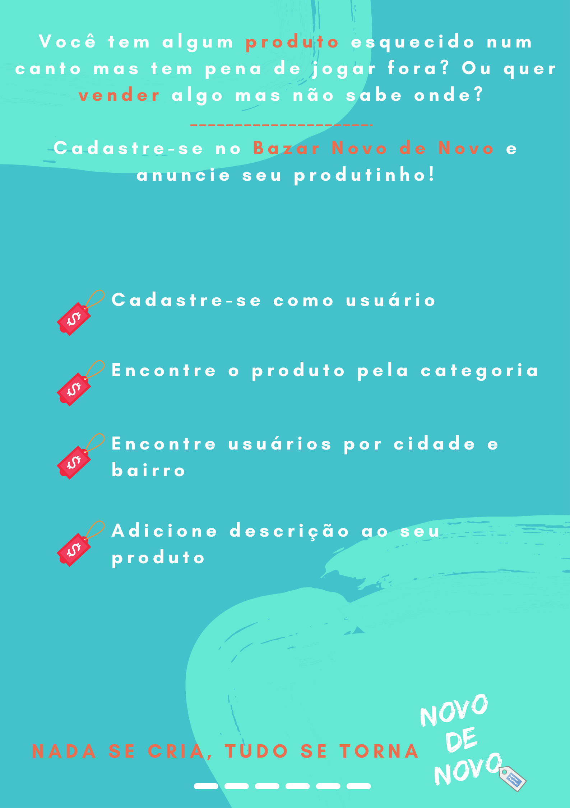

# API - <span style="color: #FF9933">Bazar </span> Novo de novo💰
## 📝 Descrição
API desenvolvida para o Projeto Final do curso de Backend da [{Reprograma}](https://reprograma.com.br/).


   >O lixo produzido mundialmente pesa em média 1,3 bilhão de tonelada. E o Brasil é o 4° país que mais produz lixo no mundo. Além da importância de reciclagem do lixo, também devemos pensar no produto antes de descartar.<br>

   >Com o objetivo de encontrar um destino - além do lixo- para produtos que ainda são úteis mas não queremos mais, o Bazar Novo de Novo foi criado. Nele você pode se cadastrar e adicionar o produto que deseja trocar, doar ou até vender.    


# Sumário

   * [Funcionalidades](#funcionalidades)
   * [Arquitetura Model View Controller - MVC](#arquitetura)
   * [Orientações para instalação](#instalação)
      * [Pré-Requisitos](#pré-requisitos)
      * [Iniciando o Back End](#iniciando-o-back-end)
      * [Tecnologias utilizadas](#tecnologias-utilizadas)
      * [Features](#features)
      * [Rotas](#rotas)
   * [Futuras atualizações](#futuras-atualizações)
   * [Agradecimentos](#agradecimentos)
   

## ✅Funcionalidades

- Cadastro de usúário;
- Busca de usuário por id;
- Busca de cadastro por categoria, cidade e bairro;
- Botão de reações (like);
- Atualização de usuários cadastrados
- Remoção de cadastro


## 📂 Arquitetura Model View Controller - MVC

      Arquitetura MVC                               
      |
       \--📂  bazar-novo-de-novo
           |
           \--📂  assets
           \--📂  node_modules
           \--📂  src
               |
               📂---controllers
                |
                |    - userController.js
                |
               📂---database
                |
                |    - mongoConfig.js
                |
               📂---models
                |
                |    - userSchema.js
                |
               📂---routes
                |
                |    - userRoutes.js
                |
            |- app.js
         |- .env
         |- .env.example
         |- .gitignore
         |-  package-lock.json
         |-  package.json
         |-  README.md
         |-  server.js
        
## 💻Orientações para instalação
* Para realizar download do projeto, siga as instruções abaixo:

### Pré-requisitos

Você precisa ter instalado em sua máquina as seguintes ferramentas:
[Git](https://git-scm.com), [Node.js](https://nodejs.org/en/) e o editor de código de sua preferência. Deixo aqui o Visual Code Studio como sugestão [VSCode](https://code.visualstudio.com/)

### 👩🏾‍💻Iniciando o Back End 

Server Local

```bash
# Com o git
# Clone este repositório
$ git clone <https://github.com/iaalcantara/bazar-novo-de-novo.git>


# Instale as dependências
$ npm install

# Execute o servidor
$ npm start

# Execute modo de desenvolvimento
$ npm run dev

# O servidor inciará na porta:7050 - acesse <http://localhost:7050>
```
* Utilize o [Postman](https://www.postman.com/) ou [Insomnia](https://insomnia.rest/download/) para chamar e testar os endpoints da API localmente.

## ⚙ Tecnologias utilizadas

Para a consturição do projeto, as seguintes tecnologias foram utilizadas:

- [JavaScript](https://www.javascript.com/)
- [Git/Github](https://github.com/)
- [Node.js](https://nodejs.org/en/)
- [Nodemon](https://nodemon.io/)
- [Express](https://expressjs.com/pt-br/)
- [Cors](https://www.npmjs.com/package/cors)
- [MongoDb](https://www.https://www.mongodb.com/)
- [Heroku](https://www.heroku.com)


### 📌Features

Funcionalidades da aplicação

- [x] Cadastros de usuários - POST
- [x] Buscar todos os usuários cadastrados - GET
- [x] Busca por categoria, cidade e bairro - GET
- [x] Botão de Reação (Like) - PATCH
- [x] Atualização do cadastro de usuários  - PUT
- [x] Apagar usuário cadastrado - DELETE

## 🛑 Rotas

POST - Cadastro de um novo usuário 
   https://localhost:7050/novo

GET - Busca todos os usuários cadastrados
   https://localhost:7050/todos

GET - Busca todos os usuários cadastrados pelo id
   https://localhost:7050/id

PATCH - Botão incremental de likes pelo id
   https://localhost:7050/id/like

UPDATE - Atualiza um usúario pelo id
   https://localhost:7050/id/update

DELETE - Deleta um usúario pelo id
   https://localhost:7050/id/remove

### 🔄 Futuras atualizações

   
      * Campo de foto para o usuário
      * Campo de foto para o produto
      * Chat para comunicação entre os usuários
      * Desenvolvimento de Front-end


# Agradecimentos

<p align="justify">À todas as mulheres incríveis que fazem parte da Reprograma, meu MUITO OBRIGADA pela oportunidade de aprender muito além da programação e as devs da minha turma 14 de backend - vocês merecem o mundo!💜</p>

# 👩🏾 Sobre a Dev
   Ingrydt Alcântara, bióloga e mestre em Biociência Animal. Graduanda no curso de Análise e Desenvolvimento de Sistemas.
